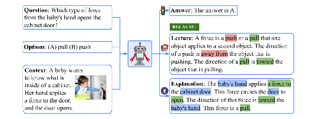
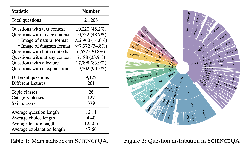
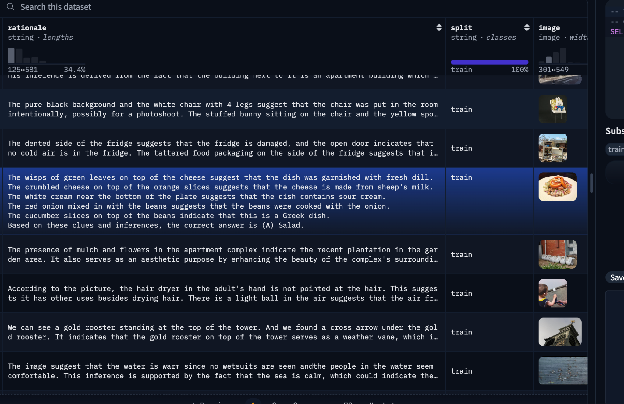
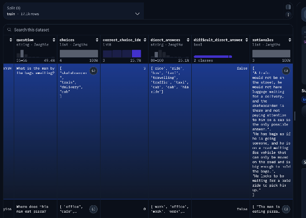
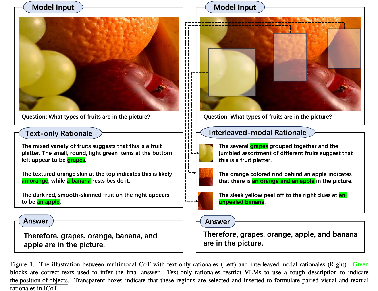
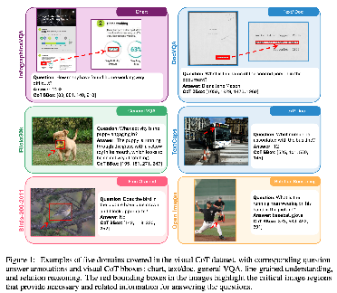
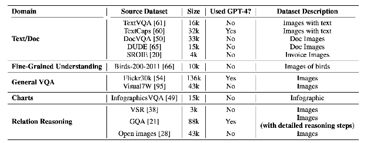
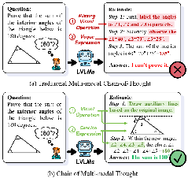
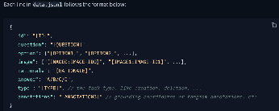

# Awesome-Multimodal-Large-Language-Models
> A curated list of Multimodal Large Language Models with SFT. 

## Table of Contents

- [Awesome-Multimodal-Large-Language-Models](#awesome-multimodal-large-language-models)
  - [Table of Contents](#table-of-contents)
  - [🔥 Supervised Finetuning](#-supervised-finetuning)
    - [Training Set](#training-set)
  - [🔥 Preference Learning](#-preference-learning)
    - [Training Set](#training-set-1)
  - [🔥 Video-LLM](#-video-llm)
    - [Training Set](#training-set-2)
    - [Training Recipe](#training-recipe)
    - [Evaluation Dataset](#evaluation-dataset)
  - [🔥 Reasoning](#-reasoning)
    - [MM-CoT](#mm-cot)
    - [Reinforcement Learning](#reinforcement-learning)

## 🔥 Supervised Finetuning

  
Visual Instruction Tuning, NIPS 2023 Oral -> LLaVA-Instruct-150K

  [paper](https://arxiv.org/abs/2304.08485) | [Github](https://github.com/haotian-liu/LLaVA) | [website](https://llava-vl.github.io/)
  

  
Improved Baselines with Visual Instruction Tuning, CVPR 2024 Highlight -> LLaVA-Instruct-665K

  [paper](https://arxiv.org/abs/2310.03744) | [Github](https://github.com/haotian-liu/LLaVA) | [website](https://llava-vl.github.io/)

  
CogVLM: Visual Expert for Pretrained Language Models, 2023 -> CogVLM-SFT-311K

  [paper](https://arxiv.org/abs/2311.03079) | [Github](https://github.com/THUDM/CogVLM) | —

  
LLaVA-OneVision: Easy Visual Task Transfer, 2024 -> LLaVA-OneVision-Data

  [paper](https://arxiv.org/abs/2408.03326) | [Github](https://github.com/LLaVA-VL/LLaVA-NeXT) | [website](https://llava-vl.github.io/blog/2024-08-05-llava-onevision/)

  
ShareGPT4V: Improving Large Multi-Modal Models with Better Captions, ECCV 2024 -> ShareGPT4V

    
  [paper](https://arxiv.org/abs/2311.12793) | [Github](https://github.com/ShareGPT4Omni/ShareGPT4V) | [website](https://sharegpt4v.github.io/)

  
ShareGPT4Video: Improving Video Understanding and Generation with Better Captions, NIPS 2024 -> ShareGPT4Video

  [paper](https://arxiv.org/abs/2406.04325v1) | [Github](https://github.com/ShareGPT4Omni/ShareGPT4Video) | [website](https://sharegpt4video.github.io/)

  
Infinity-MM: Scaling Multimodal Performance with Large-Scale and High-Quality Instruction Data, 2024 -> Infinity-MM

  [paper](https://arxiv.org/abs/2410.18558) | — | [website](https://hub.baai.ac.cn/view/40667)

  
Video Instruction Tuning with Synthetic Data, 2024 -> LLaVA-Video-178K

  [paper](https://arxiv.org/abs/2410.02713) | [Github](https://github.com/LLaVA-VL/LLaVA-NeXT) | [website](https://llava-vl.github.io/blog/2024-09-30-llava-video)

  
  
LLaVA-NeXT: Tackling Multi-image, Video, and 3D in Large Multimodal Models, 2024 -> M4-Instruct-Data

  [paper](https://arxiv.org/abs/2407.07895) | [Github](https://github.com/LLaVA-VL/LLaVA-NeXT) | [website](https://llava-vl.github.io/blog/2024-06-16-llava-next-interleave/)

  
  
Cambrian-1: A Fully Open, Vision-Centric Exploration of Multimodal LLMs, 2024 -> Cambrian-10M

  [paper](https://arxiv.org/abs/2406.16860) | [Github](https://github.com/cambrian-mllm/cambrian) | [website](https://cambrian-mllm.github.io/) 

### Training Set

| Dataset | Model | Modality | Quantity | Notes | Link |
|---------|-------|----------|----------|-------|------|
| LLaVA-Instruct-150K | LLaVA | Image | 150k |   | [LLaVA-Instruct-150K](https://huggingface.co/datasets/liuhaotian/LLaVA-Instruct-150K/blob/main/llava_instruct_150k.json)
| LLaVA-Instruct-665K | LLaVA-1.5 | Image | 665k |   | [LLaVA-Instruct-665K](https://huggingface.co/datasets/liuhaotian/LLaVA-Instruct-150K/blob/main/llava_v1_5_mix665k.json)
| CogVLM-SFT-311K | CogVLM | Image | 311k | English & Chinese | [CogVLM-SFT-311K](https://huggingface.co/datasets/THUDM/CogVLM-SFT-311K)
| LLaVA-OneVision-Data | LLaVA-OneVision | Image, Video | 1.6M |   | [LLaVA-OneVision-Data](https://huggingface.co/datasets/lmms-lab/LLaVA-OneVision-Data)
| ShareGPT4V | ShareGPT4V | Image | 1.2M | | [ShareGPT4V](https://huggingface.co/datasets/Lin-Chen/ShareGPT4V)
| ShareGPT4Video | ShareGPT4Video | Video | 4.8M | | [ShareGPT4Video](https://huggingface.co/datasets/ShareGPT4Video/ShareGPT4Video)
| Infinity-MM | Aquila-VL | Image | 34.7M | | [Infinity-MM](https://huggingface.co/datasets/Infinity-MM/Infinity-MM)
| LLaVA-Video-178K | LLaVA-OneVision (SI) | Video | 178k | Generated by GPT-4o | [LLaVA-Video-178K](https://huggingface.co/datasets/lmms-lab/LLaVA-Video-178K)
| M4-Instruct-Data | LLaVA-NeXT-Interleave | Image, Video | 1177.6K | Generated by GPT-4V | [M4-Instruct-Data](https://huggingface.co/datasets/lmms-lab/M4-Instruct-Data)
| InternVL-Chat-V1-2-SFT-Data | InternVL-Chat-V1-2 | Image | 1.2M | | [InternVL-Chat-V1-2](https://huggingface.co/datasets/OpenGVLab/InternVL-Chat-V1-2-SFT-Data)
| Cambrian-10M | Cambrian-1 | Image | 10M | | [Cambrian-10M](https://huggingface.co/datasets/nyu-visionx/Cambrian-10M)

## 🔥 Preference Learning

  
RLHF-V: Towards trustworthy mllms via behavior alignment from fine-grained correctional human feedback, CVPR 2024 -> RLHF-V-Dataset

  [paper](https://arxiv.org/abs/2312.00849) | [Github](https://github.com/RLHF-V/RLHF-V) | [website](https://rlhf-v.github.io/)

  
RLAIF-V: Aligning MLLMs through Open-Source AI Feedback for Super GPT-4V Trustworthiness, 2024 -> RLAIF-V-Dataset

  [paper](https://arxiv.org/abs/2405.17220) | [Github](https://github.com/RLHF-V/RLAIF-V) | [website](https://rlhf-v.github.io/)

  
Silkie: Preference Distillation for Large Visual Language Models, CoRR 2023 -> VLFeedback

  [paper](https://arxiv.org/abs/2312.10665) | [Github](https://github.com/vlf-silkie/VLFeedback) | [website](https://vlf-silkie.github.io/)

  
  
SPA-VL: A Comprehensive Safety Preference Alignment Dataset for Vision Language Model, 2024 -> SPA-VL

  
  [paper](https://arxiv.org/abs/2406.12030) | [Github](https://github.com/EchoseChen/SPA-VL-RLHF) | [website](https://sqrti.github.io/SPA-VL/)

  
  
Enhancing the Reasoning Ability of Multimodal Large Language Models via Mixed Preference Optimization, 2024 -> MMPR

  
  [paper](https://arxiv.org/abs/2411.10442) | [Github](https://github.com/OpenGVLab/InternVL/tree/main/internvl_chat/shell/internvl2.0_mpo) | [website](https://internvl.github.io/blog/2024-11-14-InternVL-2.0-MPO/)

### Training Set

| Dataset | Model | Modality | Quantity | Notes | Link |
|---------|-------|----------|----------|-------|------|
|RLHF-V-Dataset | MiniCPM-V 2.0 | Image | 5.7k | | [RLHF-V-Dataset](https://huggingface.co/datasets/openbmb/RLHF-V-Dataset) |
| RLAIF-V-Dataset | MiniCPM-Llama3-V 2.5 | Image | 83k | | [RLAIF-V-Dataset](https://huggingface.co/datasets/openbmb/RLAIF-V-Dataset) |
| VLFeedback | Silkie | Image | 380k | | [VLFeedback](https://huggingface.co/datasets/MMInstruction/VLFeedback) |
| SPA-VL | SPA-VL-DP | Image | 100k | Safety | [SPA-VL](https://huggingface.co/datasets/sqrti/SPA-VL) |
| MMPR | InternVL2 | Image | 3M | | [MMPR](https://huggingface.co/datasets/OpenGVLab/MMPR) |

## 🔥 Video-LLM

Video-LLaMA: An Instruction-tuned Audio-Visual Language Model for Video Understanding, 2023 -> Video-LLaMA

[paper](https://arxiv.org/pdf/2306.02858) | [Github](https://github.com/DAMO-NLP-SG/Video-LLaMA) | [website](https://video-llama.github.io/)

**TLDR:** Instruction-tuned audio-visual language model that couples video and audio encoders with LLaMA via projection layers and gated fusion, enabling open-ended video QA, captioning, and dialogue after multi-stage pretraining on web video captions and curated instruction data.

### Training Set
| Dataset | Source | Data Source | Quantity | Cnstruction Method |
|------------|--------------|--------------|--------------|--------------|
[VideoInstruct100K](https://github.com/mbzuai-oryx/Video-ChatGPT/blob/main/docs/train_video_chatgpt.md) | [Video-ChatGPT](https://arxiv.org/pdf/2306.05424) | ActivityNet | 100k | |

## 🔥 Video-LLM

### Training Recipe
| Method | Training Data | Eval Data | Recipe | Architecture |
|------------|--------------|--------------|--------------|--------------|
| [Video-LLaMA](https://arxiv.org/pdf/2306.02858) | <li> PT video/image-caption: [Webvid-2.5M](https://www.robots.ox.ac.uk/~vgg/research/frozen-in-time/), [LLaVA-CC3M](https://github.com/haotian-liu/LLaVA/blob/main/docs/Data.md) <li> SFT image-video inst tuning: [llava-150k](https://huggingface.co/datasets/liuhaotian/LLaVA-Instruct-150K), [minigpt-4 3k](https://github.com/Vision-CAIR/MiniGPT-4/blob/main/dataset/README_2_STAGE.md), [videochat-11k](https://github.com/OpenGVLab/InternVideo/tree/main/Data/instruction_data)|place_holder | place_holder | place_holder |
| [Video-LLaMA2](https://arxiv.org/pdf/2406.07476) | <li> PT video/image-caption: [Webvid-10M](https://www.robots.ox.ac.uk/~vgg/research/frozen-in-time/), [Panda-70M](https://snap-research.github.io/Panda-70M/), [VIDAL-10M](https://github.com/PKU-YuanGroup/LanguageBind/blob/main/DATASETS.md), [InternVid-10M], CC3M, [DCI](https://github.com/facebookresearch/DCI) <li> SFT image-video inst tuning: [videochat-11k](https://github.com/OpenGVLab/InternVideo/tree/main/Data/instruction_data), In-house data-12k, [Kinetics-710](https://github.com/OpenGVLab/UniFormerV2/blob/main/DATASET.md), [SthSthv2](https://developer.qualcomm.com/software/ai-datasets/something-something), NExTQA, CLEVRER, EgoQA, Tgif, WebVidQA, RealworldQA, Hm3d, Valley, VideoChatGPT, VideoChat, VTimeLLM, VideoChat2, sharegpt4v, [llava-665k](https://huggingface.co/datasets/liuhaotian/LLaVA-Instruct-150K/blob/main/llava_v1_5_mix665k.json)| place_holder | place_holder | place_holder |
| [VideoChat](https://arxiv.org/pdf/2305.06355)|<li> PT video/image-caption: [Webvid-10M](https://www.robots.ox.ac.uk/~vgg/research/frozen-in-time/), COCO Cap, VG, SBU, CC3M, CC12M <li> SFT image-video inst tuning: [videochat-11k](https://github.com/OpenGVLab/InternVideo/tree/main/Data/instruction_data), [minigpt-4 3k](https://github.com/Vision-CAIR/MiniGPT-4/blob/main/dataset/README_2_STAGE.md), 4k from [llava](https://github.com/haotian-liu/LLaVA?tab=readme-ov-file) | place_holder | place_holder | place_holder |
| [VideoChat2](https://arxiv.org/pdf/2305.06355)|<li> Stage1: [Webvid-10M](https://www.robots.ox.ac.uk/~vgg/research/frozen-in-time/), CC3M, CC12M <li> Stage2: COCO, VG, SBU, [InternVid-10M](https://huggingface.co/datasets/OpenGVLab/InternVid) <li> Stage3: [VideoChat2-IT](https://huggingface.co/datasets/OpenGVLab/VideoChat2-IT) | place_holder | place_holder | place_holder |
| [Valley](https://arxiv.org/pdf/2306.07207) | <li> PT video/image-caption: [LLaVA-CC3M](https://github.com/haotian-liu/LLaVA/blob/main/docs/Data.md)，[Valley-webvid2M-Pretrain-703K ](https://huggingface.co/datasets/luoruipu1/Valley-webvid2M-Pretrain-703K) <li> SFT inst tuning: [llava-150k](https://huggingface.co/datasets/liuhaotian/LLaVA-Instruct-150K), [videochat-11k](https://github.com/OpenGVLab/InternVideo/tree/main/Data/instruction_data), [Valley-Instruct-65K](https://huggingface.co/datasets/luoruipu1/Valley-Instruct-65k) | place_holder | place_holder | place_holder |
| [Video-ChatGPT](https://arxiv.org/pdf/2306.05424) | [VideoInstruct100K](https://github.com/mbzuai-oryx/Video-ChatGPT/blob/main/docs/train_video_chatgpt.md) | place_holder | place_holder | place_holder |
| [Video-LLaVA](https://arxiv.org/pdf/2311.10122) | <li> PT video/image-caption (same as [Valley](https://arxiv.org/pdf/2306.07207)): [LLaVA-CC3M](https://github.com/haotian-liu/LLaVA/blob/main/docs/Data.md)，[Valley-webvid2M-Pretrain-703K](https://huggingface.co/datasets/luoruipu1/Valley-webvid2M-Pretrain-703K) <li> SFT inst tuning: [llava-150k](https://huggingface.co/datasets/liuhaotian/LLaVA-Instruct-150K), [VideoInstruct100K](https://github.com/mbzuai-oryx/Video-ChatGPT/blob/main/docs/train_video_chatgpt.md) | [Video-ChatGPT Quantitative Evaluation](https://github.com/mbzuai-oryx/Video-ChatGPT/tree/main/quantitative_evaluation) | place_holder | place_holder |

### Evaluation Dataset

| Dataset | Source | Data Source | Task | Construction Method |
|------------|--------------|--------------|--------------|--------------|
[MVBench](https://github.com/OpenGVLab/Ask-Anything) | [MVBench](https://arxiv.org/abs/2311.17005) | Various | MC-VQA | |

## 🔥 Reasoning

### MM-CoT

#### Training Dataset

| Dataset | Model | Modality | Quantity | Notes | Link |
|---------|-------|----------|----------|-------|------|
| ScienceQA (NeurIPS 2022) | ScienceQA | Text + Image | 19k | Teaches CoT reasoning via detailed explanations; T-SciQ enriches prompts for smaller models.   | [Website](https://scienceqa.github.io/) |
| M3CoT (ACL 2024) | M3CoT | Text + Image | 7.86k | Long, 10-step multimodal reasoning traces curated for complex CoT supervision.  | [Paper](https://arxiv.org/abs/2405.16473) |
| A-OKVQA | A-OKVQA | Text + Image | 25k | Visual QA tasks grounded in world knowledge with CoT-style rationales.  | [Dataset](https://huggingface.co/datasets/HuggingFaceM4/A-OKVQA) |
| LLaVA-CoT-100k | LLaVA / X-KEV | Text + Image | 100k | CoT-distilled multimodal QA samples derived from LLaVA to supervise reasoning. | [Dataset](https://huggingface.co/datasets/Xkev/LLaVA-CoT-100k) |
| VideoCoT | VideoCoT | Text + Video | — | Video-based CoT corpus with active annotation for temporal reasoning. | [Paper](https://arxiv.org/abs/2407.05355) |
| VideoEspresso | VideoEspresso | Text + Video | — | Large-scale video QA dataset emphasizing fine-grained temporal CoT reasoning. | [Paper](https://arxiv.org/abs/2411.14794) |
| MAVIS | MAVIS | Text + Image | — | Math-focused multimodal reasoning dataset aligning visual math with textual explanations. | — |
| ICoT (ICLR 2025) | ICoT | Text + Image (Interleaved) | — | Interleaved visual-text chain-of-thought data for structured CoT supervision.  | [Project](https://github.com/jungao1106/ICoT) |
| Visual-CoT (NeurIPS 2024) | Visual-CoT | Text + Image | — | Unified benchmark combining image reasoning, text reasoning, and generated rationales.   | [Dataset](https://huggingface.co/datasets/deepcs233/Visual-CoT) |
| CoMT (AAAI 2025) | CoMT | Text + Image | 3.8k | Chain-of-multi-modal-thought benchmark for VQA with visual previews.   | [Paper](https://dl.acm.org/doi/10.1609/aaai.v39i22.34538) · [Dataset](https://huggingface.co/datasets/czh-up/CoMT) |
| EMMA-X | EMMA-X | Text + Image + Action | — | Robotics-oriented multimodal reasoning data derived from Bridge V2 for embodied CoT. | — |

#### Evaluation Dataset

| Dataset | Model | Modality | Quantity | Notes | Link |
|---------|-------|----------|----------|-------|------|
| CoMT Eval | CoMT | Text + Image | 3,853 | Common-domain multimodal evaluation split with reasoning traces. | [Dataset](https://huggingface.co/datasets/czh-up/CoMT) |
| OmniBench | OmniBench | Text + Image + Audio | 1,142 | Evaluates cross-modal reasoning and CoT explanation quality. | — |
| WorldQA | WorldQA | Text + Video + Audio | 1,007 | Video-centric QA testing world knowledge grounding. | — |
| MiCEval | MiCEval | Text + Image | 643 | Open-ended VQA samples measuring CoT consistency. | — |
| OlympiadBench | OlympiadBench | Text + Image | 8,476 | Science QA benchmark focusing on CoT-rich multimodal explanations. | — |
| MME-CoT | MME-CoT | Text + Image | 1,130 | Multimodal CoT tasks across science, math, and commonsense. | — |
| EMMA | EMMA | Text + Image | 2,788 | Scientific multimodal QA with mix of MC and open responses. | — |
| VisualProcessBench | VisualProcessBench | Text + Image | 2,866 | Math and science process reasoning with stepwise evaluation criteria. | — |

#### Methods

##### Prompt-based
Focuses on staged prompting, retrieval-augmented reasoning, and agentic workflows that restructure inference without additional gradient updates.

  
AntGPT — Qi Zhao et al., “AntGPT: Can Large Language Models Help Long-term Action Anticipation from Videos?” (2023).

  [paper](https://arxiv.org/abs/2307.16368) | [Github](https://github.com/brown-palm/AntGPT) | [website](https://brown-palm.github.io/AntGPT/)

  
AR-MCTS — Guanting Dong et al., “Progressive Multimodal Reasoning via Active Retrieval” (2024).

  [paper](https://arxiv.org/abs/2412.14835) | — | —

  
BDoG — Changmeng Zheng et al., “A Picture Is Worth a Graph: A Blueprint Debate Paradigm for Multimodal Reasoning” (ACM MM 2024).

  [paper](https://arxiv.org/abs/2403.14972) | [Github](https://github.com/thecharm/BDoG) | —

  A Picture Is Worth a Graph: A Blueprint Debate Paradigm for Multimodal Reasoning.

  
Chain-of-Action — Zhenyu Pan et al., “Chain-of-Action: Faithful and Multimodal Question Answering Through Large Language Models” (2024).

  [paper](https://arxiv.org/abs/2403.17359) | [Github](https://github.com/zwbx/Chain-of-Action) | [website](https://chain-of-action.github.io/)

  
Chain-of-Image — Fanxu Meng et al., “Chain of Images for Intuitively Reasoning” (2023).

  [paper](https://arxiv.org/abs/2311.09241) | [Github](https://github.com/GraphPKU/CoI) | —

  
CCoT — Chancharik Mitra et al., “Compositional Chain-of-Thought Prompting for Large Multimodal Models” (CVPR 2023).

  [paper](https://arxiv.org/abs/2311.17076) | [Github](https://github.com/chancharikmitra/CCoT) | —

  Compositional Chain-of-Thought Prompting for Large Multimodal Models.

  
CoCoT — Daoan Zhang et al., “CoCoT: Contrastive Chain-of-Thought Prompting for Large Multimodal Models with Multiple Image Inputs” (2024).

  [paper](https://arxiv.org/abs/2401.02582) | [Github](https://github.com/DAMO-NLP-SG/contrastive-cot) | —

  
CoTDet — Jiajin Tang et al., “CoTDet: Affordance Knowledge Prompting for Task Driven Object Detection” (ICCV 2023).

  [paper](https://arxiv.org/abs/2309.01093) | [Github](https://github.com/SooLab/CoTDet) | [website](https://toneyaya.github.io/cotdet/)

  CoTDet: Affordance Knowledge Prompting for Task Driven Object Detection.

  
DDCoT — Ge Zheng et al., “DDCoT: Duty-Distinct Chain-of-Thought Prompting for Multimodal Reasoning in Language Models” (NeurIPS 2023).

  [paper](https://arxiv.org/abs/2310.16436) | [Github](https://github.com/SooLab/DDCOT) | [website](https://toneyaya.github.io/ddcot/)

  DDCoT: Duty-Distinct Chain-of-Thought Prompting for Multimodal Reasoning in Language Models.

  
Det-CoT — Yixuan Wu et al., “DetToolchain: A New Prompting Paradigm to Unleash Detection Ability of MLLM” (ECCV 2024).

  [paper](https://arxiv.org/abs/2403.12488) | [Github](https://github.com/yixuan730/DetToolChain) | —

  DetToolchain: A New Prompting Paradigm to Unleash Detection Ability of MLLM.

  
Image-of-Thought — Qiji Zhou et al., “Image-of-Thought Prompting for Visual Reasoning Refinement in Multimodal Large Language Models” (2024).

  [paper](https://arxiv.org/abs/2405.13872) | — | —

  
Integrating Vision and Olfaction — Sunzid Hassan et al., “Integrating Vision and Olfaction via Multi-Modal LLM for Robotic Odor Source Localization” (Italian National Conference on Sensors 2024).

  [paper](https://www.mdpi.com/1424-8220/24/24/7875) | [Github](https://github.com/SunzidHassan/24_LLM-OSL) | [website](https://sunzidhassan.github.io/24_LLMOSL/)

  Integrating Vision and Olfaction via Multi-Modal LLM for Robotic Odor Source Localization (Italian National Conference on Sensors 2024).

  
IPVR — Zhenfang Chen et al., “See, Think, Confirm: Interactive Prompting Between Vision and Language Models for Knowledge-Based Visual Reasoning” (2023).

  [paper](https://arxiv.org/abs/2301.05226) | — | [website](https://zhenfang-chen.com/IPVR/)

  
KAM-CoT — Debjyoti Mondal et al., “KAM-CoT: Knowledge Augmented Multimodal Chain-of-Thoughts Reasoning” (AAAI 2024).

  [paper](https://arxiv.org/abs/2401.12863) | — | [website](https://mm-llms.github.io/posts/KAM-CoT/)

  KAM-CoT: Knowledge Augmented Multimodal Chain-of-Thoughts Reasoning.

  
Language Is Not All You Need — Shaohan Huang et al., “Language Is Not All You Need: Aligning Perception with Language Models” (NeurIPS 2023).

  [paper](https://arxiv.org/abs/2302.00052) | [Github](https://github.com/chenfei-wu/TaskMatrix) | [website](https://taskmatrix.ai/)

  Language Is Not All You Need: Aligning Perception with Language Models.

  
L3GO — Yutaro Yamada et al., “L3GO: Language Agents with Chain-of-3D-Thoughts for Generating Unconventional Objects” (2024).

  [paper](https://arxiv.org/abs/2402.09052) | [Github](https://github.com/runopti/L3GO) | [website](https://yutaroyamada.com/L3GO/)

  
LPE — Jingran Xie et al., “Leveraging Chain of Thought Towards Empathetic Spoken Dialogue Without Corresponding Question-Answering Data” (2025).

  [paper](https://arxiv.org/abs/2501.10937) | — | —

  
PKRD-CoT — Xuewen Luo et al., “PKRD-CoT: A Unified Chain-of-Thought Prompting for Multi-Modal Large Language Models in Autonomous Driving” (2024).

  [paper](https://arxiv.org/abs/2412.02025) | — | —

  
RAGAR — M. Abdul Khaliq et al., “RAGAR, Your Falsehood Radar: RAG-Augmented Reasoning for Political Fact-Checking Using Multimodal Large Language Models” (2024).

  [paper](https://arxiv.org/abs/2404.12065) | [Github](https://github.com/ICTMCG/LLM-for-misinformation-research) | —

  
SegPref — Yaoting Wang et al., “Can Textual Semantics Mitigate Sounding Object Segmentation Preference?” (ECCV 2024).

  [paper](https://arxiv.org/abs/2407.10947) | [Github](https://github.com/GeWu-Lab/Sounding-Object-Segmentation-Preference) | —

  Can Textual Semantics Mitigate Sounding Object Segmentation Preference?

  
TextCoT — Bozhi Luan et al., “TextCoT: Zoom In for Enhanced Multimodal Text-Rich Image Understanding” (2024).

  [paper](https://arxiv.org/abs/2404.09797) | [Github](https://github.com/bzluan/TextCoT) | —

  
VideoAgent — Xiaohan Wang et al., “VideoAgent: Long-form Video Understanding with Large Language Model as Agent” (ECCV 2024).

  [paper](https://arxiv.org/abs/2403.10517) | — | [website](https://videoagent.github.io/)

  
VisualSketchpad — Yushi Hu et al., “Visual Sketchpad: Sketching as a Visual Chain of Thought for Multimodal Language Models” (2024).

  [paper](https://arxiv.org/abs/2406.09403) | [Github](https://github.com/Yushi-Hu/VisualSketchpad) | [website](https://visualsketchpad.github.io/)

  
Human I/O — Xingyu Bruce Liu et al., “Human I/O: Towards a Unified Approach to Detecting Situational Impairments” (CHI 2024).

  [paper](https://arxiv.org/abs/2403.04008) | [Github](https://github.com/google/humanio) | [website](https://research.google/pubs/human-io-towards-comprehensive-detection-of-situational-impairments-in-everyday-activities/)

  Human I/O: Towards a Unified Approach to Detecting Situational Impairments.

  
VoT — Hao Fei et al., “Video-of-Thought: Step-by-Step Video Reasoning from Perception to Cognition” (ICML 2024).

  [paper](https://arxiv.org/abs/2501.03230) | — | —

  Video-of-Thought: Step-by-Step Video Reasoning from Perception to Cognition.

  
VIC — Haojie Zheng et al., “Thinking Before Looking: Improving Multimodal LLM Reasoning via Mitigating Visual Hallucination” (2024).

  [paper](https://arxiv.org/abs/2411.12591) | [Github](https://github.com/Terry-Xu-666/visual_inference_chain) | —

##### Training-based
Captures methods that adapt model parameters, inject new supervision, or modify architectures to strengthen multimodal chain-of-thought abilities.

  
AVQA-CoT — Guangyao Li et al., “AVQA-CoT: When CoT Meets Question Answering in Audio-Visual Scenarios” (CVPR Workshops 2024).

  [paper](https://sightsound.org/papers/2024/Li_AVQA-CoT_When_CoT_Meets_Question_Answering_in_Audio-Visual_Scenarios.pdf) | — | —

  AVQA-CoT: When CoT Meets Question Answering in Audio-Visual Scenarios (CVPR Workshops 2024).

  
Audio-CoT — Ziyang Ma et al., “Audio-CoT: Exploring Chain-of-Thought Reasoning in Large Audio Language Model” (2025).

  [paper](https://arxiv.org/abs/2501.07246) | — | —

  
Cantor — Timin Gao et al., “Cantor: Inspiring Multimodal Chain-of-Thought of MLLM” (ACM MM 2024).

  [paper](https://arxiv.org/abs/2404.16033) | [Github](https://github.com/ggg0919/cantor) | [website](https://ggg0919.github.io/cantor/)

  Cantor: Inspiring Multimodal Chain-of-Thought of MLLM (ACM MM 2024).

  
CoT-PT — Jiaxin Ge et al., “Chain of Thought Prompt Tuning in Vision Language Models” (2023).

  [paper](https://arxiv.org/abs/2304.07919) | — | —

  
G-CoT — Yao Yao, Zuchao Li, and Hai Zhao, “Beyond Chain-of-Thought, Effective Graph-of-Thought Reasoning in Language Models” (2023).

  [paper](https://arxiv.org/abs/2305.16582) | [Github](https://github.com/amazon-science/mm-cot) | —

  
Grounding-Prompter — Houlun Chen et al., “GroundingPrompter: Prompting LLM with Multimodal Information for Temporal Sentence Grounding in Long Videos” (2023).

  [paper](https://arxiv.org/abs/2312.17117) | — | —

  
LoT — Shanshan Zhong et al., “Let’s Think Outside the Box: Exploring Leap-of-Thought in Large Language Models with Creative Humor Generation” (CVPR 2024).

  [paper](https://arxiv.org/abs/2312.02439) | — | —

  Let’s Think Outside the Box: Exploring Leap-of-Thought in Large Language Models with Creative Humor Generation (CVPR 2024).

  
LlamaV-o1 — Omkar Thawakar et al., “LlamaV-o1: Rethinking Step-by-Step Visual Reasoning in LLMs” (2025).

  [paper](https://arxiv.org/abs/2501.06186) | [Github](https://github.com/mbzuai-oryx/LlamaV-o1) | —

  
MC-CoT — Cheng Tan et al., “Boosting the Power of Small Multimodal Reasoning Models to Match Larger Models with Self-consistency Training” (ECCV 2024).

  [paper](https://arxiv.org/abs/2311.14109) | [Github](https://github.com/chengtan9907/mc-cot) | —

  Boosting the Power of Small Multimodal Reasoning Models to Match Larger Models with Self-consistency Training (ECCV 2024).

  
MCoT-Memory — Xiwen Liang et al., “Memory-driven Multimodal Chain of Thought for Embodied Long-horizon Task Planning” (OpenReview 2025).

  [paper](https://arxiv.org/abs/2412.11974) | — | —

  Memory-driven Multimodal Chain of Thought for Embodied Long-horizon Task Planning (OpenReview 2025).

  
Meaformer — EMNLP 2023 (introduces neighbor-aware hierarchical multimodal transformers for alignment).

  [paper](https://arxiv.org/abs/2212.14454) | [Github](https://github.com/zjukg/MEAformer) | —

  EMNLP 2023 (introduces neighbor-aware hierarchical multimodal transformers for alignment).

  
MGCoT — Yao Yao, Zuchao Li, and Hai Zhao, “Beyond Chain-of-Thought, Effective Graph-of-Thought Reasoning in Language Models” (2023).

  [paper](https://arxiv.org/abs/2305.16582) | [Github](https://github.com/amazon-science/mm-cot) | —

  
Multimodal-CoT — Yao Yao et al., “Multimodal Chain-of-Thought Reasoning in Language Models” (2023).

  [paper](https://arxiv.org/abs/2302.00923) | [Github](https://github.com/amazon-science/mm-cot) | —

  
PCoT — Lei Wang et al., “T-SciQ: Teaching Multimodal Chain-of-Thought Reasoning via Large Language Model Signals for Science Question Answering” (AAAI 2024).

  [paper](https://arxiv.org/abs/2305.03453) | [Github](https://github.com/T-SciQ/T-SciQ) | —

  T-SciQ: Teaching Multimodal Chain-of-Thought Reasoning via Large Language Model Signals for Science Question Answering (AAAI 2024).

  
PS-CoT — Qun Li et al., “PS-CoT-Adapter: Adapting Plan-and-Solve Chain-of-Thought for ScienceQA” (Science China Information Sciences, 2025).

  [paper](https://link.springer.com/article/10.1007/s11432-024-4211-9) | [Github](https://github.com/Sunhxxin/PS-CoT-Adapter) | —

  PS-CoT-Adapter: Adapting Plan-and-Solve Chain-of-Thought for ScienceQA (Science China Information Sciences, 2025).

  
TVC — ACL 2025 (Visual conditioning via dynamic pruning; citation forthcoming).

  — | — | —
  ACL 2025 (Visual conditioning via dynamic pruning; citation forthcoming).

  
Visual-o1 — Minheng Ni et al., “Visual-o1: Understanding Ambiguous Instructions via Multi-modal Multi-turn Chain-of-Thoughts Reasoning” (2024).

  [paper](https://arxiv.org/abs/2410.03321) | [Github](https://github.com/kodenii/Visual-o1) | —

  
Virgo — Yifan Du et al., “Virgo: A Preliminary Exploration on Reproducing o1-like MLLM” (2025).

  [paper](https://arxiv.org/abs/2501.01904) | [Github](https://github.com/RUCAIBox/Virgo) | —

### Reinforcement Learning

Focuses on reinforcement learning or policy optimization steps that explicitly reward improved multimodal reasoning behavior.

  
Deepseek-R1 — Daya Guo et al., “Deepseek-R1: Incentivizing Reasoning Capability in LLMs via Reinforcement Learning” (2025).

  [paper](https://arxiv.org/abs/2501.12948) | [Github](https://github.com/deepseek-ai/DeepSeek-R1) | [website](https://www.deepseek.com/blog/deepseek-r1)

  
LLaVA-Reasoner — Ruohong Zhang et al., “Improve Vision Language Model Chain-of-Thought Reasoning” (2024).

  [paper](https://arxiv.org/abs/2410.16198) | [Github](https://github.com/RifleZhang/LLaVA-Reasoner-DPO) | —

